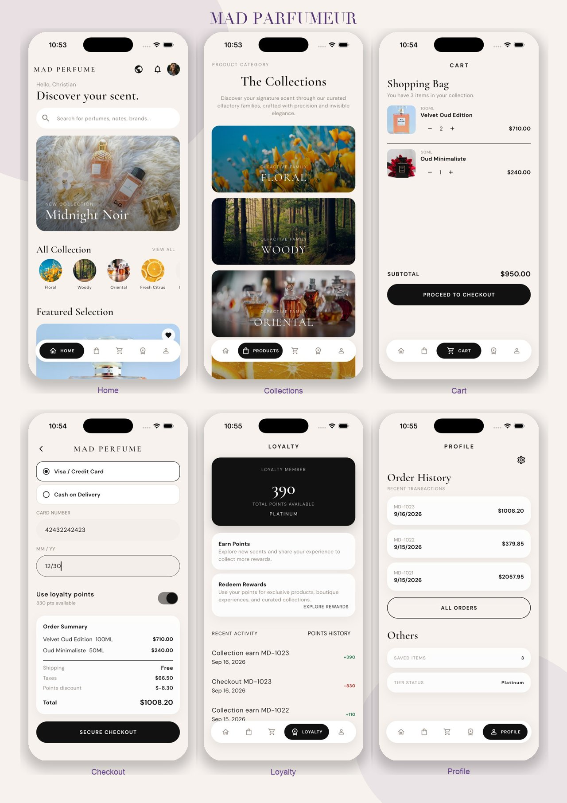

# MAD Parfumeur

Luxury perfume shopping — collections, cart, loyalty, and boutique discovery.

<p align="center">
  
</p>

## Highlights

- Home hero, olfactory collections, and featured scents
- Cart, checkout, loyalty points, and order tracking
- English, Arabic, and Hebrew with RTL
- Flutter + BLoC, Dio, get_it, and GetX routing/localization
- Real staging backend integration with rotating JWT authentication

See [API integration notes](docs/API_INTEGRATION.md) for implemented flows and
the external configuration still required for Stripe, push notifications, and
social sign-in.

## Run

```bash
flutter pub get
flutter run
```
