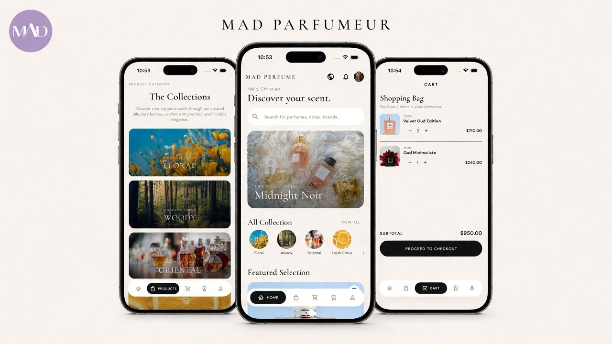
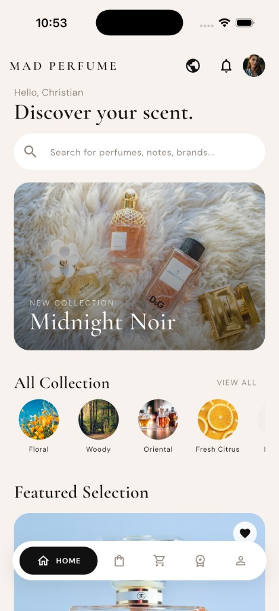
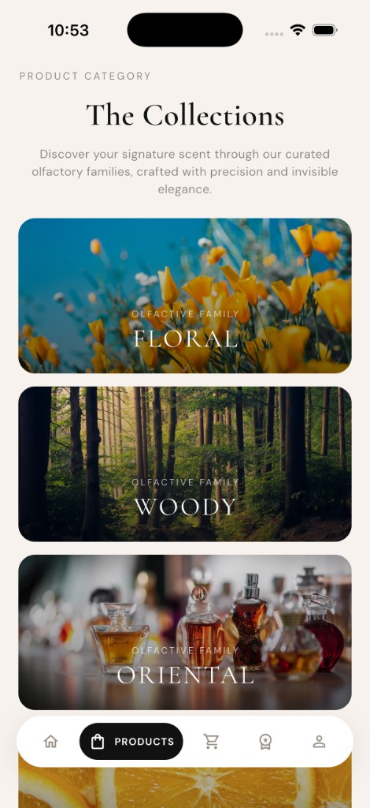
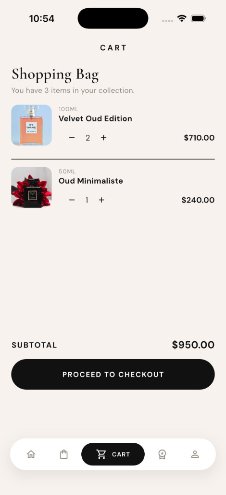
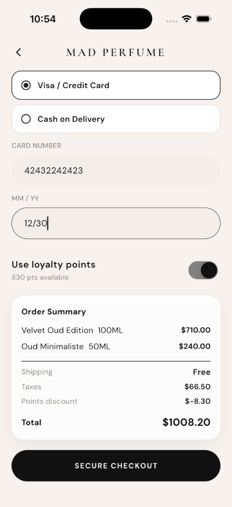
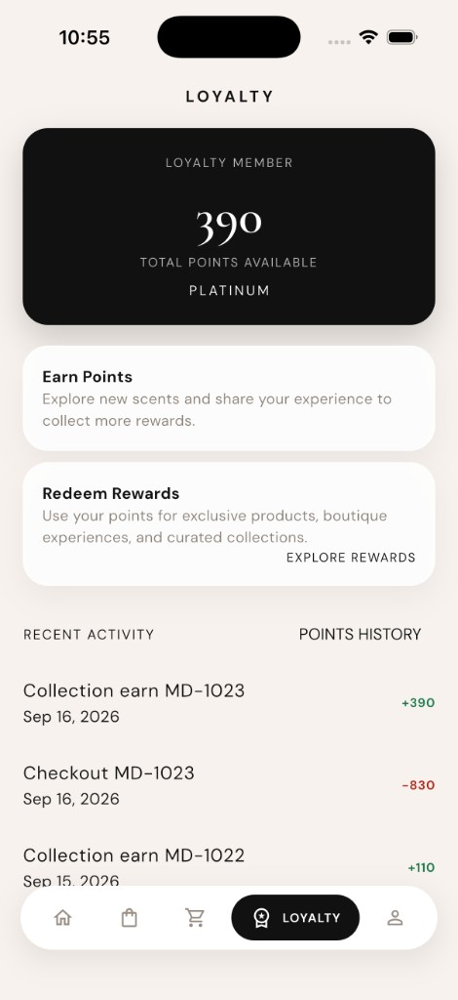
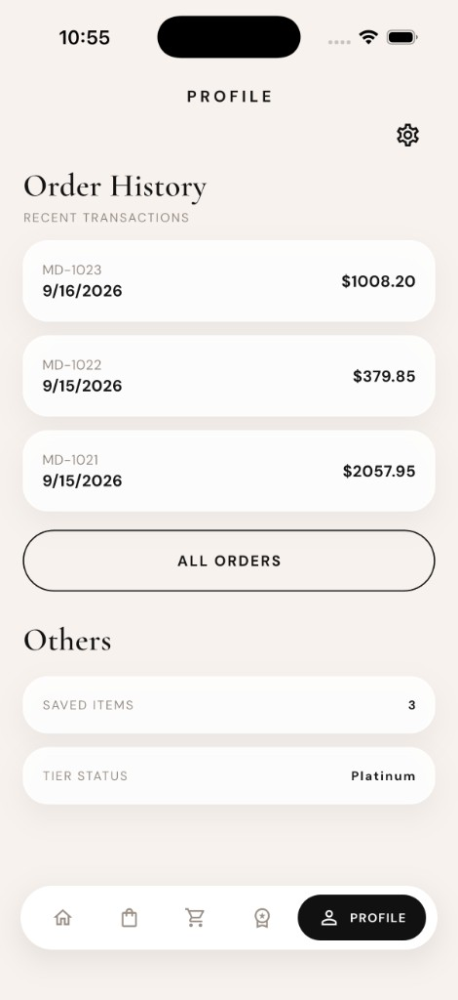
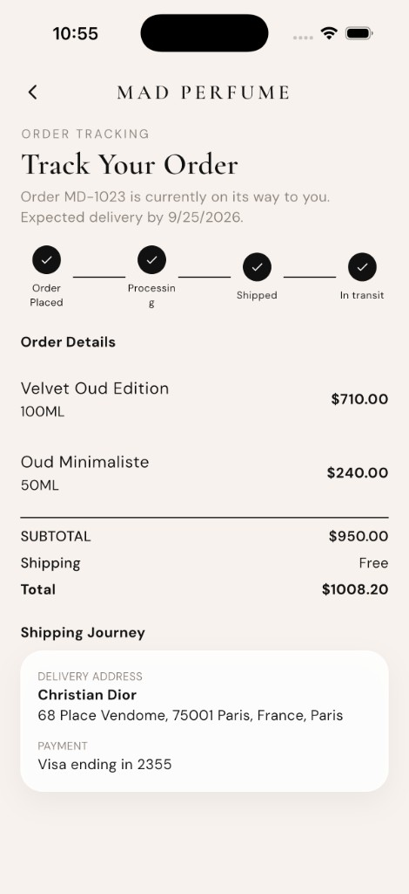

# MAD Parfumeur

Luxury perfume shopping — collections, cart, loyalty, and boutique discovery.

<p align="center">
  
</p>

<p align="center">
  
</p>

## Screens

<p align="center">
  
  
  
  
  
  
  
</p>

## Highlights

- Home hero, olfactory collections, and featured scents
- Cart, checkout, loyalty points, and order tracking
- English, Arabic, and Hebrew with RTL
- Flutter + GetX

## Run

```bash
flutter pub get
flutter run
```

Demo: `name@example.com` / `123456`
